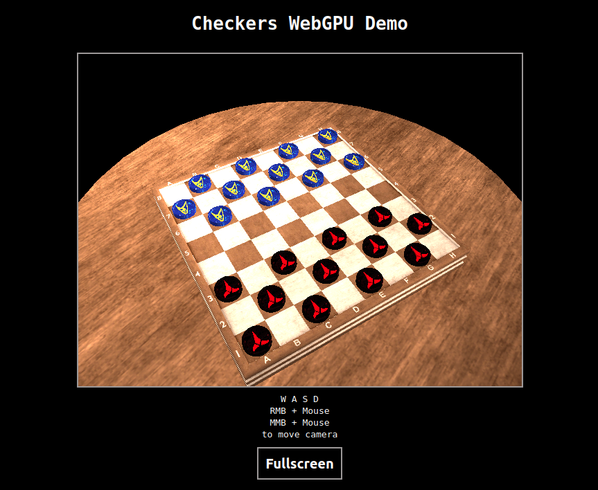

# Checkers WebGPU Demo

This is a simple checkers game implemented using WebGPU, featuring a Star Trek theme. The primary purpose of this project is to explore the new (2023) WebGPU API, rather than creating a fully functional game. Please note that the user input functionality is not yet refined.

Feel free to examine the source code and utilize it as a starting point for your own WebGPU projects.

Note: WebGPU is still under development and may not be supported by all browsers. This demo will only function correctly on browsers with WebGPU enabled. For browser compatibility details, refer to the [Mozilla Developer Network documentation](https://developer.mozilla.org/en-US/docs/Web/API/WebGPU_API#browser_compatibility).

Check out the online demo [here](https://webgpu-checkers.vercel.app/).

## How to run

To run the demo locally, follow these steps:

- Clone this repository.
- Run `npm install` to install the necessary dependencies.
- Execute `npm run dev` to start a local server on port 4000.

## Assets
The following assets were used in this project:

-   [Checker 3D Meshes](https://www.thingiverse.com/thing:5791393)
-   [Table](https://skfb.ly/6BYHM) by yryabchenko is licensed under Creative Commons Attribution (http://creativecommons.org/licenses/by/4.0/).
-   [Chessboard](https://skfb.ly/6CIDt) by ClearanceClarence is licensed under Creative Commons Attribution (http://creativecommons.org/licenses/by/4.0/).
